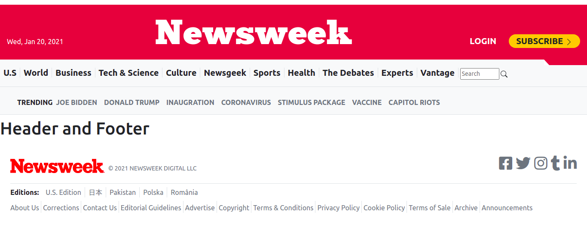

# Project Name: Newsweek Clone

## Week 3 - Collaborative Project [Bootstrap]

This is a collaborative project of Microverse, to build fully responsive page based on this  site:

[Live Demo clone site](https://web.archive.org/web/20210120125445/https://www.newsweek.com/)

This project was created as a clone of Newsweek website. In this exercise, Bootstrap framework are applied in order to create the layout of the website fully responsive and functional as much similar to the original as possible.

A mobile-first approach is used: The page is designed for the mobile version first and then the mediaqueries are created for the tablet and desktop versions.

This is the third project for Microverse.

> Skills Revived & Learned:

- Versioning & best practices of maintaining branches of safe deployed and local dev
- git flow & Github flow
- HTML, CSS new and better elements, semantics, features etc
- Cloning - the hard work and skills needed to successfully make a clone.
- Linter - install & fix tests
- Collaborative learning, being patient, helping each other succeed.
- Attending Daily standup, being focused, accountable.

> Learning Goals:

- Version Control & CSS.
- Introduction to HTML & CSS concepts.
- CSS animations & transitions.
- Responsive Website design.
- CSS frameworks (Bootstrap).

## Built With

- Major languages: HTML, CSS.
  
- Frameworks used: Bootstrap CSS Framework.

## Screenshots

- 
- 

## Live Demo

[Newsweek-clone](https://carlos-osorio-developer.github.io/mv-week3-bootstrap/)

## Getting Started

To get a local copy up and running follow these simple example steps.

### Prerequisites

1. Vs code

2. Terminal (Bash)

3. Linter tests

4. Git

### Setup

Setup by  following the installation instructions below :
Open your terminal and locate on the folder you want to clone the repository.

### Install

Run the following command into your terminal:

```console
git clone https://github.com/carlos-osorio-developer/mv-week2-responsive
```

### Usage

Run index.html in your preferred browser.

## Authors

👤 **Carlos Osorio**

- GitHub: [@carlos-osorio-developer](https://github.com/carlos-osorio-developer)
- Twitter: [@OsorioDevelops](hhttps://twitter.com/@OsorioDevelops)
- LinkedIn: [Carlos Osorio](https://www.linkedin.com/in/carlos-osorio-developer/)

👤 **Francis**

- GitHub: [@francisuloko](https://github.com/francisuloko)
- Twitter: [@francisuloko](https://www.twitter.com/francisuloko)
- LinkedIn: [francisuloko](http://www.linkedin.com/in/francisuloko)

## 🤝 Contributing

Contributions, issues, and feature requests are welcome!

Feel free to check the [issues page](./issues/).

## Show your support

Give a ⭐️ if you like this project!

## Acknowledgments

- Thanks to Microverse and their supportive community.
- Thanks to everyone commiting in this project.

## 📝 License

This project is [MIT](lic.url) licensed.
